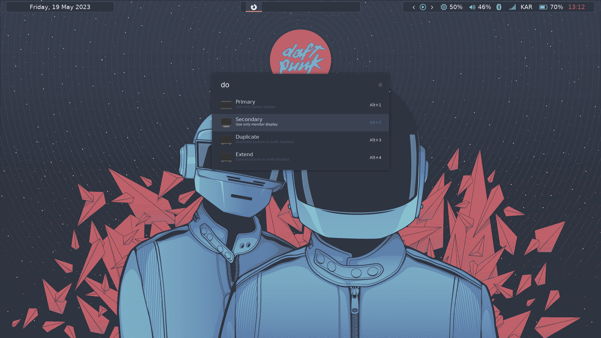

## Xrandr display options

A simple ulauncher extension that toggles between display modes:
- Primary Only
- Secondary Only
- Extend
- Display
*(Extension assumes a laptop is connected to an external display)*

Uses Papirus Icons pack.

